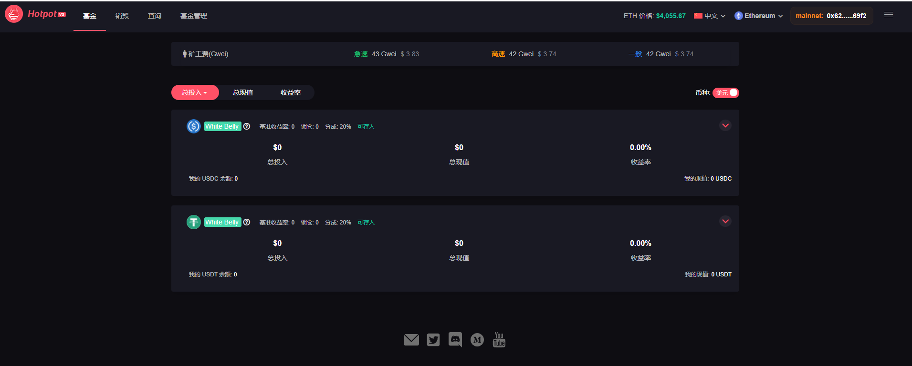
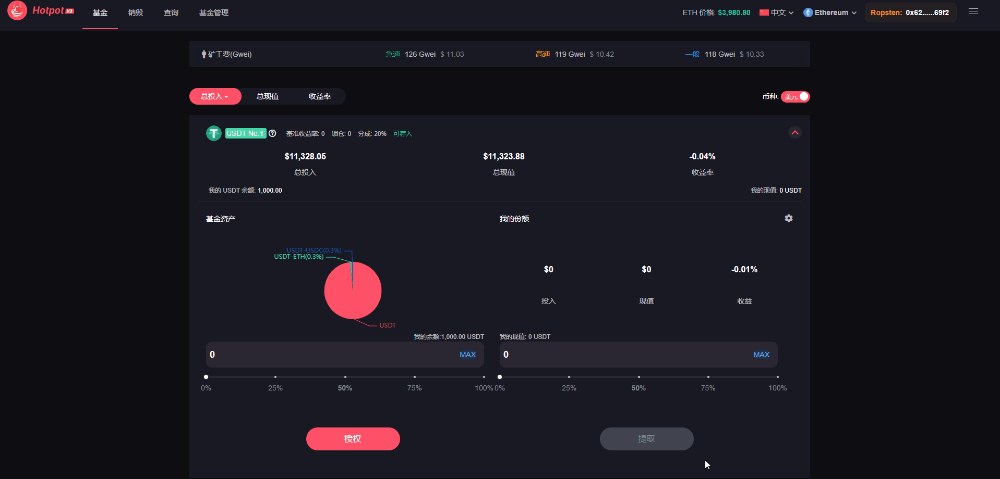
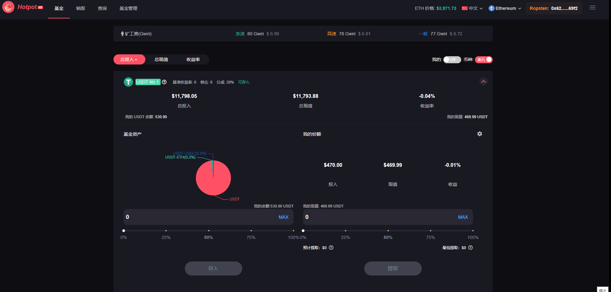

# 投资

任何个人或机构都可以在 [Hotpot](https://hotpot.fund) 平台上进行投资。Hotpot V3 的投资方向是 Uniswap V3 流动池，得益于 Uniswap V3 聚焦流动性的特点，在 Hotpot V3 上可以投资多种不同策略的基金,详细说明：请参阅[基金介绍](../2-基金经理/01-介绍.md#手续费型基金)

##  介绍

页面提供了**ETH美元价格**，实施的展示当前网络的**矿工费**。**多语言**支持中文和英文。可以根据总投入等信息**排序**来选择符合个人心目中的基金。如对代币本身价值不熟悉，亦可以切换为**美元**给予更直观的价值体验。同时支持**Arbitrum**二层网络基金，

### 链接钱包

* PC端

用谷歌或火狐，添加metamask插件,再登录[https://hotpot.fund](https://hotpot.fund),友情链接：[metamask安装链接](https://www.chaintopic.com/document/6772.html)

* 手机端

使用以太坊链钱包,在Dapp输入[https://hotpot.fund](https://hotpot.fund),友情推荐：麦子钱包，imtoken，TokenPocket

### 授权及存入

1.除ETH外的所有代币，在进行存入操作前，都需要先点击**授权**

2.或手动输入，或拖动滑动条，或MAX等操作来选择存入数量

3.点击**存入**，等待链上确认

> **请注意锁仓值**，比如，锁仓为1天的基金，投资该基金后,1天内无法取出，如锁仓时间未解除,又在该基金新存入一笔，那么锁仓时间重置，需重新等待1天后才能进行提取,详细说明：请参阅[锁仓期(Lock Period)](../2-基金经理/02-名词解释.md#锁仓期lock-period)

### 滑点及提取

1.设置滑点容差,及交易截止时间(滑点容差默认0.5,交易截止时间默认180分钟)

2.或手动输入，或拖动滑动条，或MAX等操作来选择提取值。

3.点击**提取**，等待链上确认

## 名称解释

### 授权

以太坊区块链上的大多数代币，如 USDC 和 HPT，都采用 ERC20 标准。ERC20 代币实际上是智能合约，包含不同的方法，如transferFrom和burn。用户调用这些方法，应用就会对代币做相应的操作。

**approve(授权)**:任何你想要使用的 dApp 都需要访问你的 ERC20 代币才能对其进行操作

> 如果你想要在 HotPot 中存入 USDC，你首先需要授予 HotPot dApp 的智能合约访问 USDC 的权限，然后才能通过第二笔交易将 USDC 存入 HotPot。你可以在你的以太坊钱包用户界面上看到该授权。

### 滑点容差

详细说明：请参阅[滑点和价格影响](../2-基金经理/14-附录5：滑点和价格影响.md)

### 交易截止时间

因链上交易的Gas波动,可能造成链上交易长时间处于pending状态,现在设置交易截止时间后，如超过交易截止时间，交易自动失败。

### 预计提取

用户盈利时，盈利部分去掉基金经理和平台收益之后的预计提取值

用户亏损时，预计提取值等于提取值

### 最低提取

预计提取值考虑了价格滑点和价格影响止后的计算出最低提取值,如链上提取值小于最低提取金额，则交易失败
