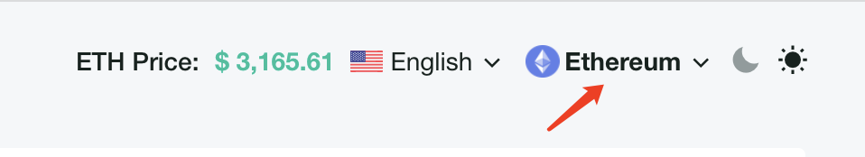
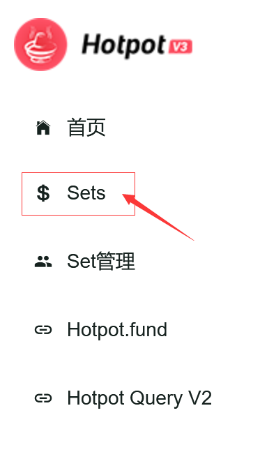
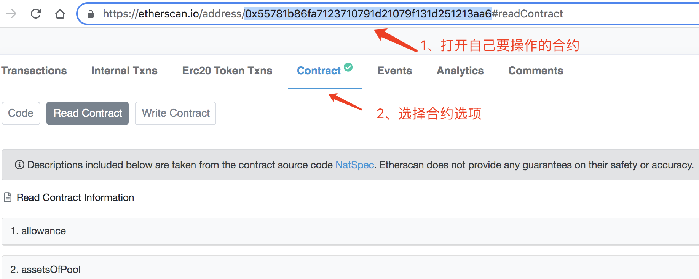
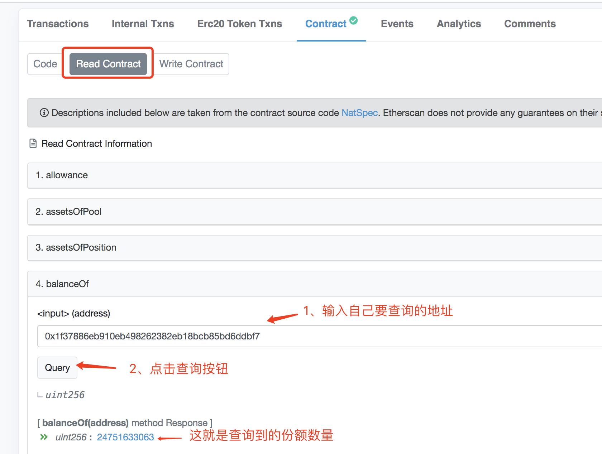
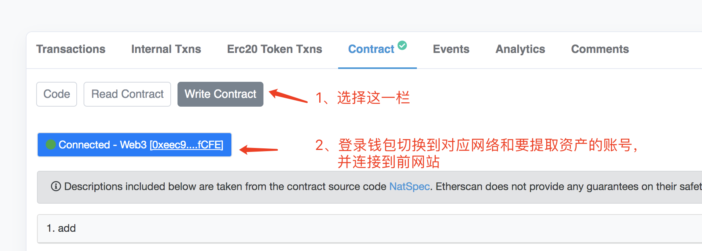
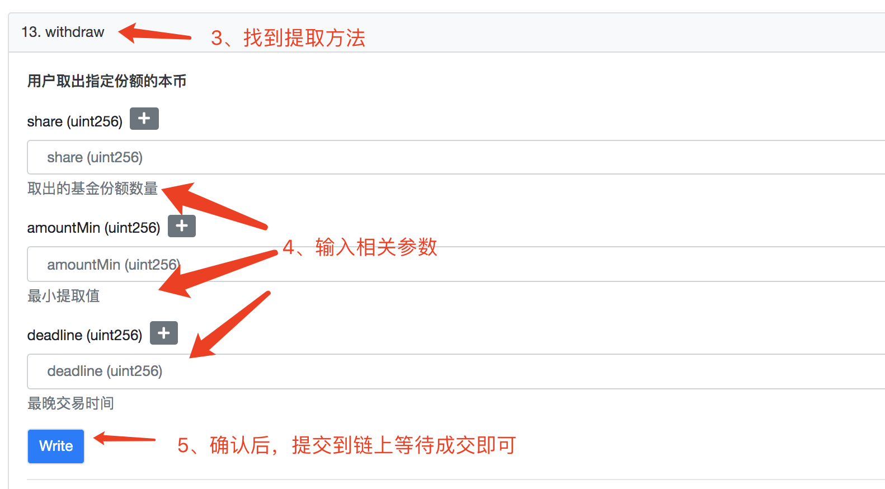

# 用etherscan提取自己的投资

## 第一步 找合约地址

1. 打开query:
   [https://query.hotpot.fund](https://query.hotpot.fund/) 或 [https://query.hotpot.financial](https://query.hotpot.financial/)
   
2. 切换到 etherscan 网络 

   

3. 在 Sets 页面找到您要投资的基金
   
   
4. 点击打开该基金的详情，找到合约地址并复制: 

   

5. 为了保证query也无法打开的时候能够访问，建议自行保留该合约地址.

## 第二步 etherscan 操作

1. 打开etherscan网站: https://etherscan.io/ 或 https://cn.etherscan.com/

2. 打开合约地址和ABI操作窗口，这里以其中一个Set举例，其组合后的地址为：https://etherscan.io/address/0x55781b86fa7123710791d21079f131d251213aa6#readContract

   

   

3. 查询“我的份额”，切换到Read Contract选项，如下所示：

   

   

4. 操作withdraw方法提取资产，如下所示：

   

   

   **注意：**

   + share：是指你能提取的份额数量，也就是上一步查询到的份额数量；
   + **amountMin：是指提取成功后最少收到的本币数量，需要注意这里是按最小精度算的值，另外设得太低可能会被链上机器人套利攻击，建议设一个自己能接受的最小值；**
   + deadline：是指最晚交易时间戳，单位是秒，超过这个时间，交易就会自动失败。