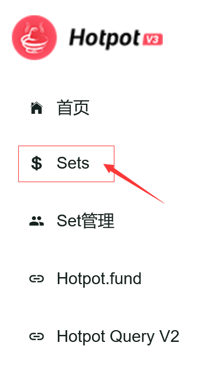
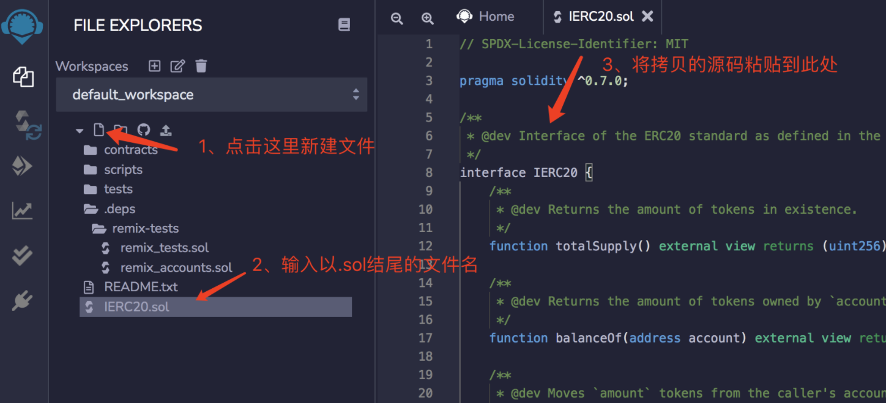

# 用Remix工具提取自己的投资

## 第一步 找合约地址

1. 打开query:
   [https://query.hotpot.fund](https://query.hotpot.fund/) 或 [https://query.hotpot.financial](https://query.hotpot.financial/)
2. 切换到你要查找的网络
3. 在 Sets 页面找到您要投资的基金
   
4. 点击打开该基金的详情，找到合约地址并复制: 
5. 为了保证query也无法打开的时候能够访问，建议自行保留该合约地址.

## 第二步 Remix 操作

1. 打开在线remix网站: http://remix.ethereum.org/#optimize=true&runs=800&evmVersion=null&version=soljson-v0.7.6+commit.7338295f.js

   

2. 从GitHub上分别导入以下2个合约代码到remix中：

   1. 查询“我的份额”合约接口：https://github.com/OpenZeppelin/openzeppelin-contracts/blob/solc-0.7/contracts/token/ERC20/IERC20.sol
   2. 发起“提取”操作合约接口：https://github.com/HotPotFund/HotPotFundsV3/blob/main/contracts/interfaces/fund/IHotPotV3FundUserActions.sol

   

   如果报以下这种错误，请继续向下看，如果没有请跳过：

   

   

   

   回到remix窗口，按如下方式新建文件方式导入：

   

   

3. 编译合约，这里以IHotPotV3FundUserActions.sol合约举例说明，IERC20.sol合约操作类似。

   

   

4. 构建ABI操作接口，这里以IHotPotV3FundUserActions.sol合约举例说明，IERC20.sol合约操作类似。

   

   

5. 查询”我的份额“，展开按上面步骤创建的IERC20 ABI操作接口，如下所示：

   

   

6. 操作withdraw方法提取资产，展开IHotPotV3FundUserActions ABI操作接口，如下所示：

   

   **注意：**

   + share：是指你能提取的份额数量，也就是上一步查询到的份额数量；
   + **amountMin：是指提取成功后最少收到的本币数量，需要注意这里是按最小精度算的值，另外设得太低可能会被链上机器人套利攻击，建议设一个自己能接受的最小值；**
   + deadline：是指最晚交易时间戳，单位是秒，超过这个时间，交易就会自动失败。

