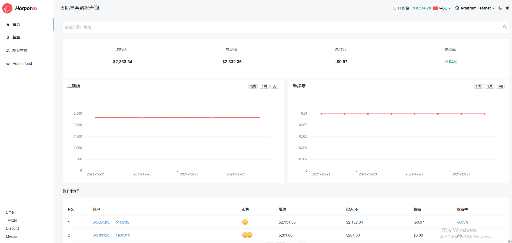

# 查询

> 在 Hotpot 平台上，投资者所做的任何操作，以及基金经理所做的任何操作都是透明的。[Hotpot Query](https://query.hotpot.fund/) 帮助投资者查询平台数据，包括交易明细、账户排行、用户收益等情况，帮助投资者快速分析数据。

## 查询基金

通过浏览器，任何人都可以在 [Hotpot Query](https://query.hotpot.fund/) 上查询基金情况，无需使用钱包软件。查询页面提供**网络切换**、当前**ETH价格**、**多语言包**。也可根据账户排行或者交易明细信息进行**排序**来查看对应数据。

> 如何在 [Hotpot Query](https://query.hotpot.fund/) 上查询基金?

在PC浏览器或手机浏览器中打开 [Hotpot Query](https://query.hotpot.fund/)，打开查询页面。点击 [首页](https://query.hotpot.fund/)，查询您要需要查看的基金或账户详情，页面中带蓝色字体的数据都可以点击，可查看账户明细、交易明细，以及交易相关的 [etherscan](https://cn.etherscan.com) 链接。包括：

* 选择网络

  > 选择网络查看对应数据

* 从首页总览中查看

  > 从账户排行或交易明细中查看数据

* 输入账户地址查看

  > 搜索框中输入账户地址查看数据