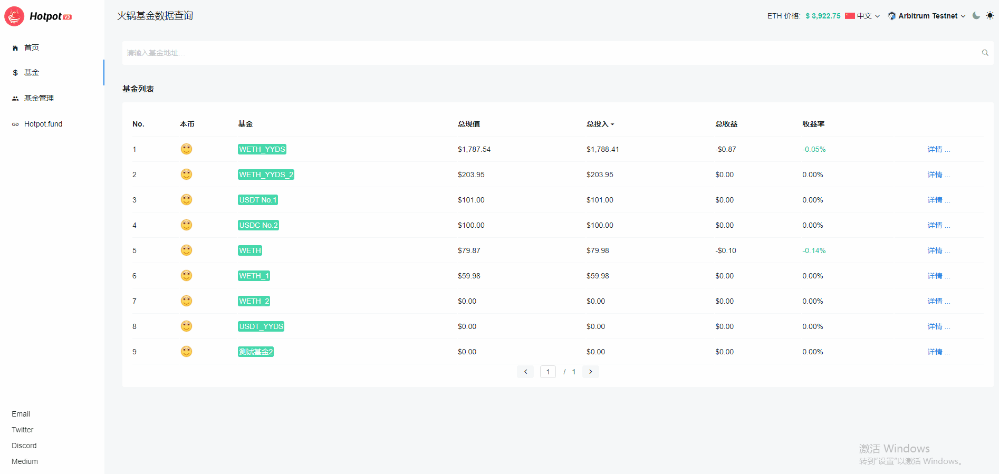

# 基金

> Hotpot 是一个基金平台。任何个人或机构，都可以在 Hotpot 平台上免审核地创建一支以透明和免信任方式运作的基金。基金经理根据自身的操作策略和投资者群体的特点，自行决定是否有锁仓期，以及基准收益率、基金经理分成比率等参数。用户可以通过[基金](https://query.hotpot.fund/fund)查看了解基金的总体信息和交易明细。

在PC浏览器或手机浏览器中打开 [Hotpot Query](https://query.hotpot.fund/fund)，打开查询页面。点击[基金](https://query.hotpot.fund/fund)，查询基金信息和交易详情，包括：

* 选择网络

  > 选择网络查看对应数据

* 选择基金

  > 从基金列表中选择基金查看数据

* 输入账户地址查看

  > 搜索框中输入账户地址查看数据