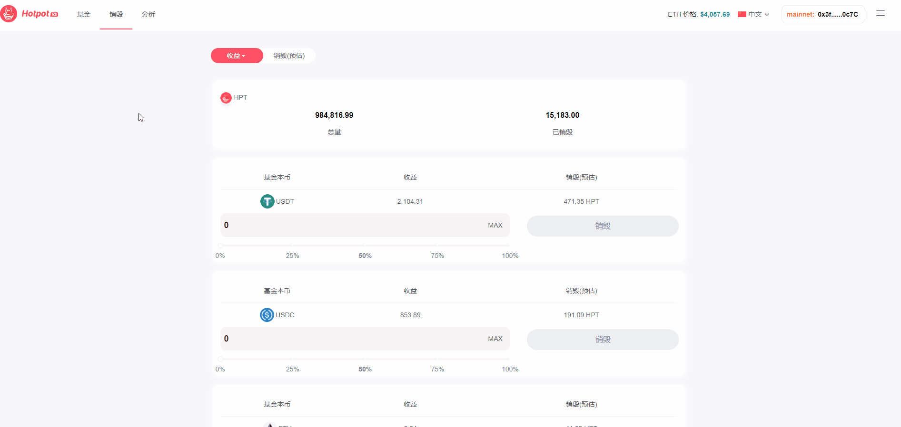

## 销毁

> 销毁 HPT 代币，是 Hotpot 平台获得分成收益的唯一方式。

任何个人或机构都可以在 [Hotpot](https://hotpot.fund/Burn) 平台上销毁基金代币基金。

Hotpot 平台代币：Hotpot Funds (Symbol: HPT)。Hotpot 平台的分成收益全部归 HPT 代币持有者所有。用户在提取时，其收益的 5%，以基金本币的形式支付给控制器合约，这部分分成归 HPT代币持有者所有。控制器合约提供一个公共的销毁 (harvest) 函数，任何人都可以调用该函数销毁 HPT 代币。销毁的过程是从 Uniswap V3 交易所购入 HPT，然后进行销毁。

## 代币信息

代币符号：HPT

1. 名称：Hotpot Funds

2. 初始发行量：100 万

3. 特性：可以销毁，无法新增，纯粹的通缩型代币。

## 价值捕获

HPT 代币持有者捕获火锅基金收益的方式，不是直接将基金收益分发给代币持有者，而是通过用基金收益在 Uniswap 交易所购买 HPT 代币并销毁。所有购买、销毁的操作都由智能合约驱动，任何人都可以调用控制器合约的销毁 (harvest) 函数，完成代币购买、销毁的操作。

具体方式如下：

1. 基金收益，都被归集到控制器合约 (Controller) 中；

3. 控制器合约提供一个 harvest 函数入口，用归集的基金收益在 Unsiwap V3上兑换 HPT，同时完成销毁;

4. 当基金有收益被归集到控制器合约后，任何人都可以调用控制器合约的 harvest函数，完成 HPT 销毁的操作。

HPT 代币是一种纯粹通缩型的代币，它使得 HPT 价格具有丰富的想象空间，能够增强 HPT 代币的价值。

在浏览器或手机钱包中打开 Hotpot Dapp，点击 销毁，打开销毁页面，连接您的钱包。点击 销毁 按钮，销毁步骤包括：

1.选择用来销毁HPT的代币

2.输入或选择需要销毁的数量

点击 销毁 按钮，然后在钱包软件中确认提交，等待链上交易确认信息，完成销毁操作。

