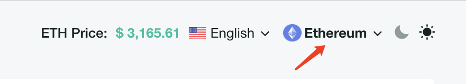
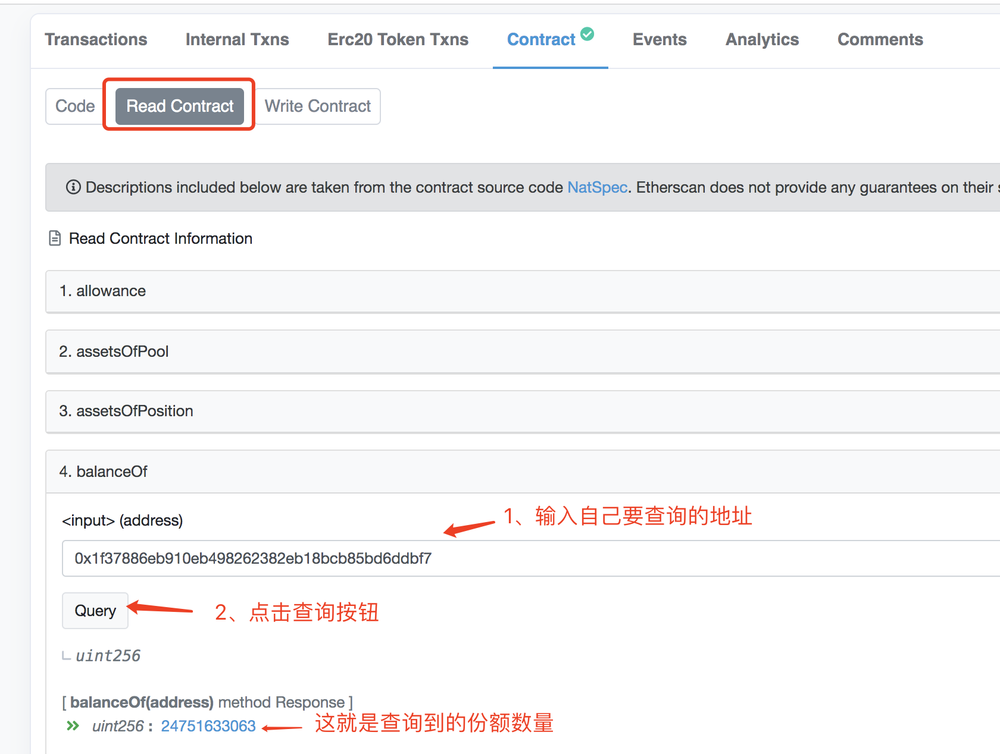
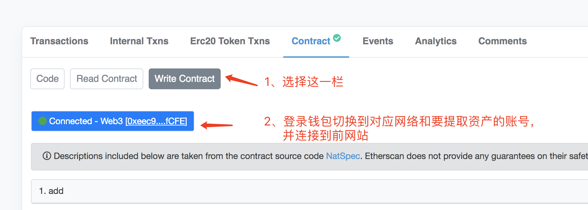

# 用polygonscan提取自己在polygon网络上的投资

## 第一步 找合约地址

1. 打开query:
   [https://query.hotpot.fund](https://query.hotpot.fund/) 或 [https://query.hotpot.financial](https://query.hotpot.financial/)
   
2. 切换到 polygon 网络 

   

3. 在 Sets 页面找到您要投资的基金
   
   
4. 点击打开该基金的详情，找到你要操作的合约地址并复制: 

   

5. 为了保证query也无法打开的时候能够访问，建议自行保留该合约地址.

## 第二步 polygonscan 操作

1. 打开polygonscan网站: https://polygonscan.com/

2. 打开合约地址和ABI操作窗口，这里以其中一个Set举例，其组合后的地址为：https://polygonscan.com/address/0x0057e03bf57e0dab2a10445afa7d3be99a6832c1#readContract
   
   
3. 查询“我的份额”，“总的份额”，“总的资产”，切换到Read Contract选项，如下所示：

   

   

4. 操作withdraw方法提取资产，如下所示：

   

   

   **注意：**

   + share：是指你能提取的份额数量，也就是上一步查询到的份额数量；
   + **amountMin：是指提取成功后最少收到的本币数量，需要注意这里是按最小精度算的值，另外设得太低可能会被链上机器人套利攻击，建议设一个自己能接受的最小值，计算公式如下：**
   
     ​               **`amountMin = myShare / totalShare * totalAssets  * ( 1 - slippage)`**
     
     > 比如：“我的份额”myShare等于67217613042，”总的份额“totalShare等于68583129785，“总的资产”  totalAssets等于48372868766，可接受的"最小交易滑点"slippage是0.5%，那么计算结果如下（结果值取整数部分）：
     >
     > `amountMin = 67217613042 / 68583129785 * 48372868766 * (1 - 0.005) = 47172697436`
     
   + **deadline**：是指最晚交易时间戳，单位是秒，超过这个时间，交易就会自动失败。
   
     > 比如：
     >
     > + 设一个很大的时间戳：10000000000
     > + 未来1个小时内：`60 * 60 + nowTimestamp`，其中`nowTimestamp`是当前时刻的时间戳(秒为单位)