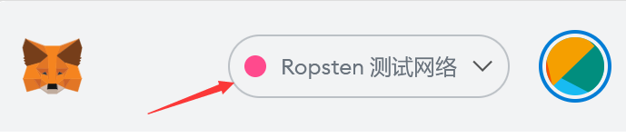

# 在测试网练习

和所有的智能合约一样，Set 合约一旦创建，就不能再更改。在创建正式的 Set 之前，Set 经理需要在测试网做一些练习。Hotpot 在 Ropsten 和 Arbitrum Testnet 上部署了智能合约，您可以在这两个测试网上先进行一些练习，然后再在正式网络上进行操作。而且正式网络上的每一次操作都需要花费 gas，所以在正式操作之前进行一些练习是必要的。

## 切换到测试网

大多数手机钱包并不支持测试网，建议使用 MetaMask 操作。

在 MetaMask 中，将网络切换到测试网：

然后按照后面文档的介绍，创建Set、初始化Set和管理Set。

下面是获得测试网代币的方法：

## 获得Ropsten测试网上的ETH

从Ropsten Faucet(水龙头) 上可以获得 Ropsten 测试网上的 ETH：https://faucet.ropsten.be/

它每次只给一个账户 0.3 ETH，如果您想要获得更多 ETH，需要间隔一段时间再申请，也可以多用一些账户、用不同的IP地址分别获取，再汇聚到一个账户上。 

练习完成之后，如果您申请的测试网 ETH 没有使用完，请将它们归还回去。

## 获得Arbitrum Testnet上的ETH

Arbitrum Testnet 对应的以太坊测试链是 Rinkeby，获取测试 ETH 首先需要获得 Rinkeby 上的 ETH。

从Rinkeby Faucet(水龙头)上可以获得 Rinkeby 测试网上的 ETH：https://faucet.rinkeby.io/

它需要您拥有 Twitter 或 Facebook 账户，发一篇推文或 Facebook 帖子，把账户地址包含进去，然后粘贴推文或帖子链接，点击 "Give me Ether" 就可以获得测试用的 ETH。

Rinkeby Faucet 如果不可用，另外一个可选的是：https://faucets.chain.link/rinkeby 这里每次可以获得 0.1 ETH 和 10 LINK。

将您的 MetaMask 网络切换到 Rinkeby 测试链，通过 Arbitrum 桥 (https://bridge.arbitrum.io/) 将测试 ETH 存入 Arbitrum Testnet。

再将 MetaMask 网络切换到 Arbitrum Testnet，然后您就可以创建并管理 Arbitrum Testnet 上的 Set。

除了 ETH 之外，如果您还需要其它代币，Uniswap V3 在 Ropsten 和 Arbitrum Testnet 都进行了部署，您只需切换到相应的网络，就可以在 Uniswap V3 上用 ETH 兑换所需的代币。

需要注意的是：测试网上的基础设施远没有主网完善。比如，Uniswap上就缺乏测试网的代币列表，如果在测试网上进行交易，需要您自行输入测试代币的合约地址。