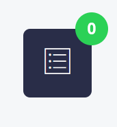
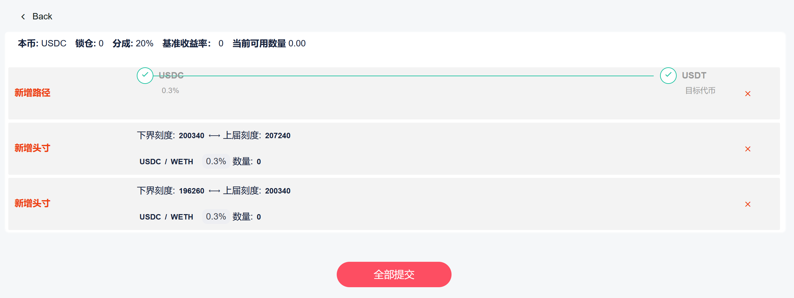

# 批量操作

Set 经理要完成的操作很多，无论是初始化还是日常管理中，都会发起很多操作。Hotpot V3 为 Set 经理提供了批量操作能力，将多个操作合并到一笔交易之中，可以显著降低总的 Gas 消耗，从而大幅节约 Set 经理的管理成本。

在 Set 经理的管理页面中，您随时能够看到下面的操作列表图标。点击该列表，即可打开已经添加到操作列表中的操作，点击 **全部提交** 按钮，操作列表中的操作在一笔交易中全部完成。

> 注：当操作列表中没有操作时(右上角显示的操作数为0)，不能打开操作列表。

操作列表页面如下图所示，点击 **全部提交** 按钮，然后在钱包软件中确认，等待链上交易确认信息，完成操作。

