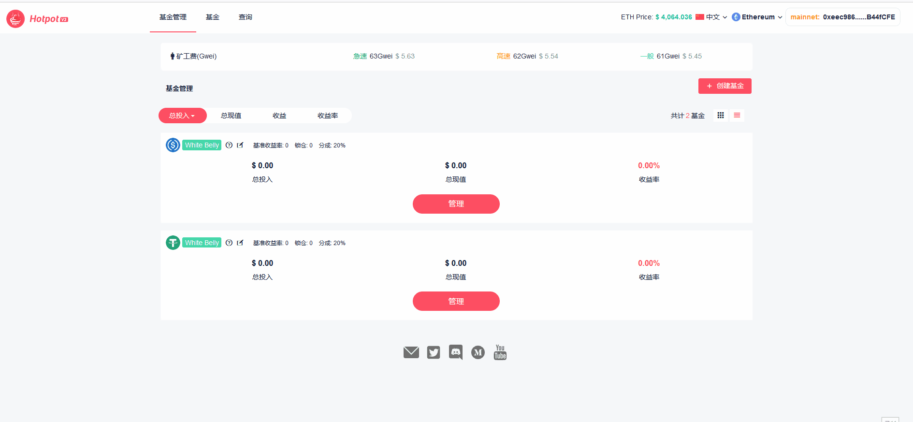
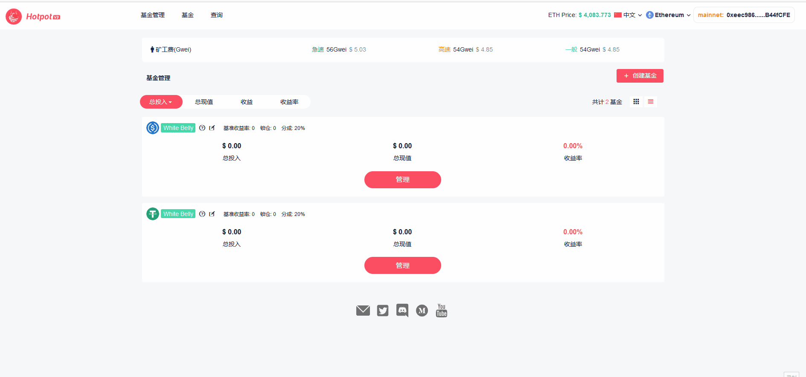
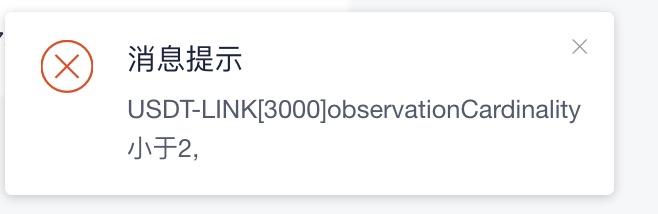
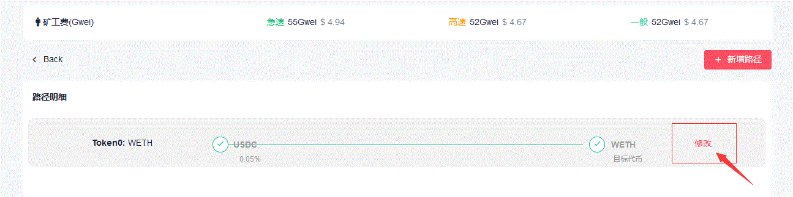
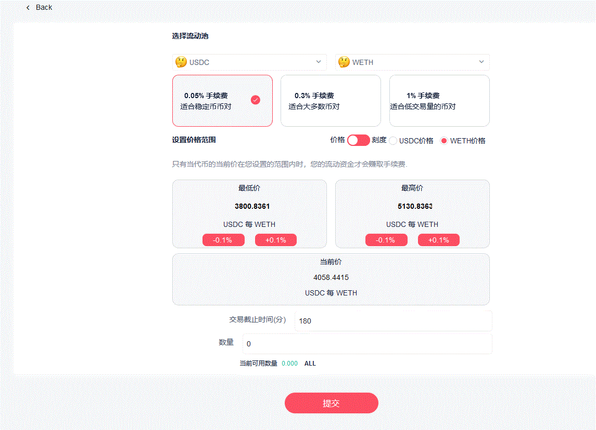

# 初始化Set

> Set创建好之后，还需要进行一些初始化工作。

## 第1步 设置最迟存入时间

> 如果您的Set是一支开放式Set，可以忽略这一步。

Set创建完成之后，您就可以在Set管理页面中看到自己所创建的Set。

管理Set的第1步，是设置该支Set的最迟存入时间。

在 [**Set管理**](https://manager.hotpot.fund) 页面中，选择要管理的Set，点击 **管理** 按钮，再点击右下角的 **最迟存入时间** 打开设置页面。设置完成之后点击 **确认** ，添加到操作列表。

> **最迟存入时间** 最迟存入时间不能小于当前时间。最迟存入时间过后，该支Set就不再接受投资者存入。Set经理可以随时调整最迟存入时间，它是一个非常有趣的设置，给予了Set经理随时将Set置于封闭状态的能力。默认的最迟存入时间是一个很大的数字，如果您不设置最迟存入时间，则意味着该支Set始终向投资者开放。

## 第2步 设置交易路径

管理Set的第2步，是设置拟投资代币的交易路径。您准备投资的交易对中的所有代币，都需要先设置交易路径。

> **交易路径** Hotpot V3 平台投资的是 Uniswap V3 交易对流动池，每个流动池都是由两种代币组成。Hotpot V3 平台上在Set本币和所投资的流动池代币之间，需要进行兑换，这些兑换也全部是通过 Uniswap V3 完成。所以，首先您需要为拟投资的每种非Set本币的代币，设置其在 Uniswap V3 交易所中，从Set本币到目标代币的交易路径。后续在您管理流动池头寸时，Hotpot 会自动完成Set本币和目标代币之间的兑换，这些兑换操作都会经由该路径完成。
>
> Hotpot 平台不支持 Uniswap V3 在前端提供的智能路由功能 (*智能路由是链下技术，Hotpot 的智能合约本来就不可能支持*)，所以您需要在Set管理页面为每种非Set本币的代币设置交易路径。
>
> 交易路径和拟投资的交易对可以不同。比如，某支Set本币为USDC的Set，您计划投资 USDC/WETH 0.3% 的交易对流动池，但设置的 USDC/WETH 的交易路径设置的是通过 USDC/WETH 0.05% 交易对，这是完全可行的。实际上，我们建议您设置交易路径时，尽量选择手续费率较低、TVL 值较大的交易对。手续费率低，意味着您每次兑换动作需要付出的成本更低；TVL 值大，意味着兑换时的价格滑点更低。比如，USDC/WETH 之间的交易，建议您设置 USDC/WETH 0.05% 的交易对，它的手续费率更低。而对于投资的交易对，不同的操作策略则会有不同的选择。所以我们说，**交易路径和投资的交易对是不同的概念**。
>
> 在 Uniswap V3 上，大部分代币 TVL 值最大的交易对是与 WETH 之间的交易对，因此：Set本币 - WETH - 目标代币 的交易路径，或许是最常见的交易路径。

在 [**Set管理**](https://manager.hotpot.fund) 页面中，选择要管理的Set，点击 **管理** 按钮，点击右下角的 **路径配置** 进入交易路径设置页面，点击 **新增路径** 按钮添加交易路径。选择目标代币，选择手续费率即可。如果您需要在Set本币和目标代币之间，通过多个步骤完成兑换 (这是很常见的情况)，在路径配置页面中点击 **新增**，就会增加一个路径条目，继续选择目标代币和手续费率，即可配置一个多步交易的交易路径。配置完成之后点击 **确定** ，添加到操作列表。

> 目标代币的交易路径配置完成后，您所投资的所有包含该目标代币的交易对流动池，都会使用该交易路径进行兑换。也就是说，不需要为每个交易对单独配置交易路径。比如，本币为 USDC 的Set，如果已经配置了 USDC/WETH 的交易路径，那么无论您投资了 WETH 和其它任何代币的交易对，本币和 WETH 之间的兑换都会通过该交易路径完成。

**注意错误提示**，在设置某些路径时，页面上可能会报错，提示消息类似于下图这样。这是因为路径中有Uniswap V3 池子的"observationCardinality"(预言机观察点)长度不够，需要Set经理自己将其长度设置为2以上的值，然后才能继续设置交易路径。
>     
> [设置Uniswap V3 池子的"observationCardinality"(预言机观察点)长度的简单教程](./15-附录6：设置预言机长度.html)

**修改交易路径** 目标代币的交易路径后续虽然可以修改，但是必须是在已经清空了所有包含该目标代币的流动池头寸的前提下。如果您已经在包含该目标代币的交易对流动池中作了投资，在没有清空这些头寸之前，交易路径不能被修改。 

> 

> 修改该交易路径的前提是：所有包含 WETH 的流动池头寸，都已经被清空。

## 第3步 新增流动池

拟投资的两种代币的交易路径都配置完成后(不含Set本币)，您就可以为Set新增流动池了。

> 实际上，Hotpot 平台上没有显式的新增流动池的操作。当您新增的头寸是一个新的流动池，自然会新增一个流动池。Set管理页面中有显式的新增流动池按钮，只是为了方便Set经理的操作，它的操作实际上就是新增一个头寸。

在 [**Set管理**](https://manager.hotpot.fund) 页面中，选择要管理的Set，点击 **管理** 按钮，点击右上角的 **新增流动池**。在该页面中选择流动池的两种代币，选择手续费率，设置头寸的价格范围 (如何设置价格范围，请参阅 [**关于价格范围**](./11-附录2：关于价格范围.md))。新增流动池时，您可以向头寸中投资也可以不投。如果要投资的话，就设置好投资的本币数量，否则设为0。点击 **确定** ，添加到操作列表。

## 第4步 新增头寸

新增头寸操作和新增流动池类似。

在 [**Set管理**](https://manager.hotpot.fund) 页面中，选择要管理的Set，点击 **管理** 按钮，选择要增加的流动池，点击右上角的 **新增头寸** 按钮。在页面中设置头寸的价格范围 (如何设置价格范围，请参阅 [**关于价格范围**](./11-附录2：关于价格范围.md))。

新增头寸时，您可以向头寸中投资也可以不投。如果要投资的话，就设置好投资的本币数量，否则设为0。点击 **确定** ，添加到操作列表。

头寸一旦增加，只能被清空，不会被删除。
