## 找到Uniswap V3 池子的地址

可以在info.uniswap.org官网，通过搜索栏找到需要的池子地址：
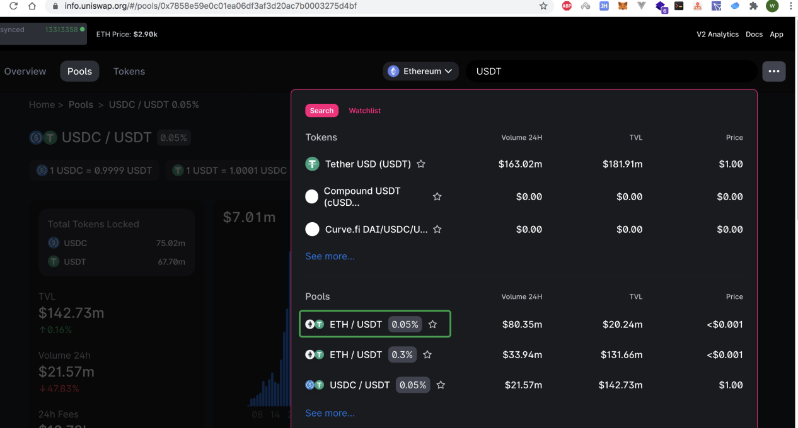

浏览器地址栏末尾就是池子地址，或者可以直接点击如下所示的图标，可以直接跳转到etherscan上去：
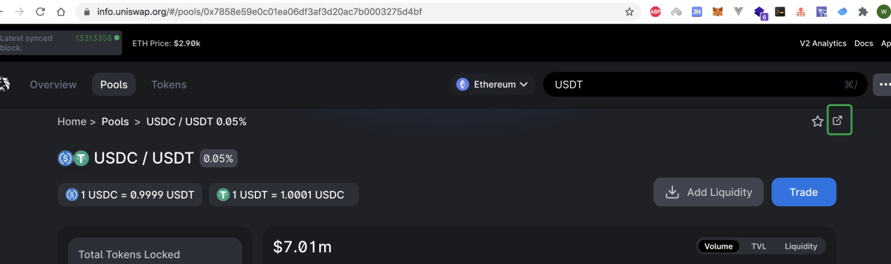

## 在etherscan上查看预言机长度

找到对应池子的合约源码栏，查看它当前的"预言机观察点"长度，**如果该值已经是大于等于2的值，那么就不用再设置该值**，如下：
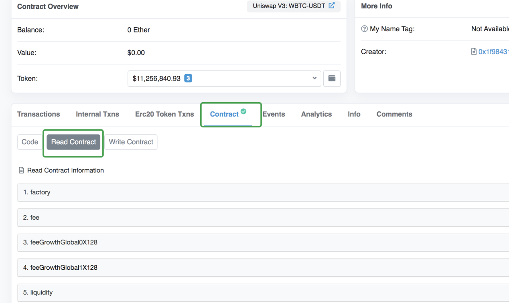
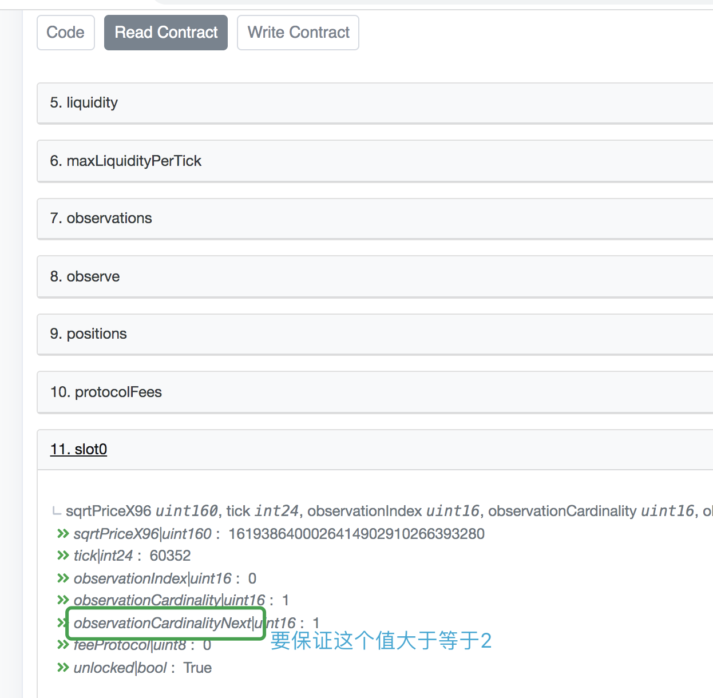

## 检查合约是否开源
点击"Write Contract"按钮，如果提示如下图所示，那么表示合约还未开源，需要自己去验证合约开源：
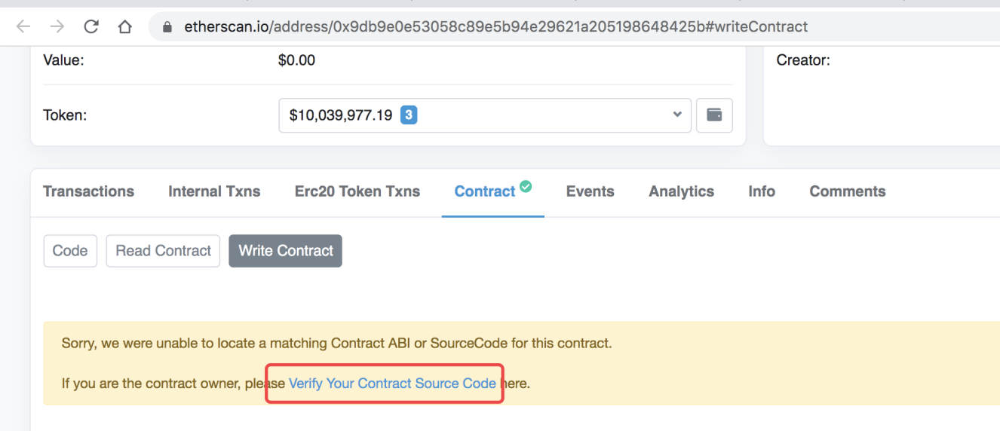

## 开源合约

开源合约的步骤如下：
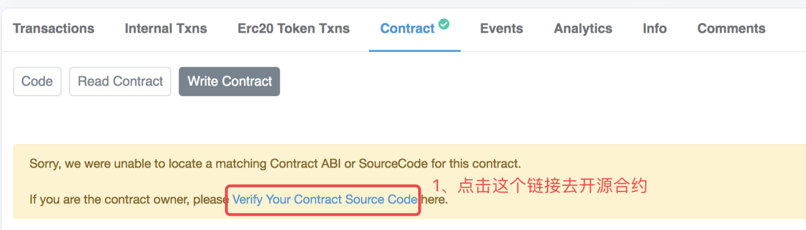
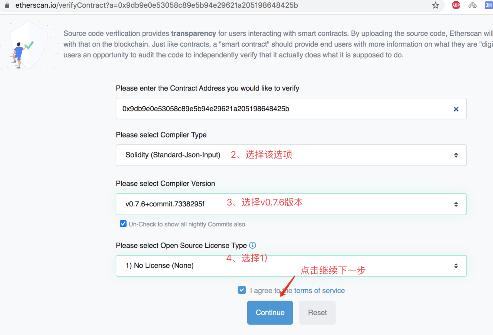
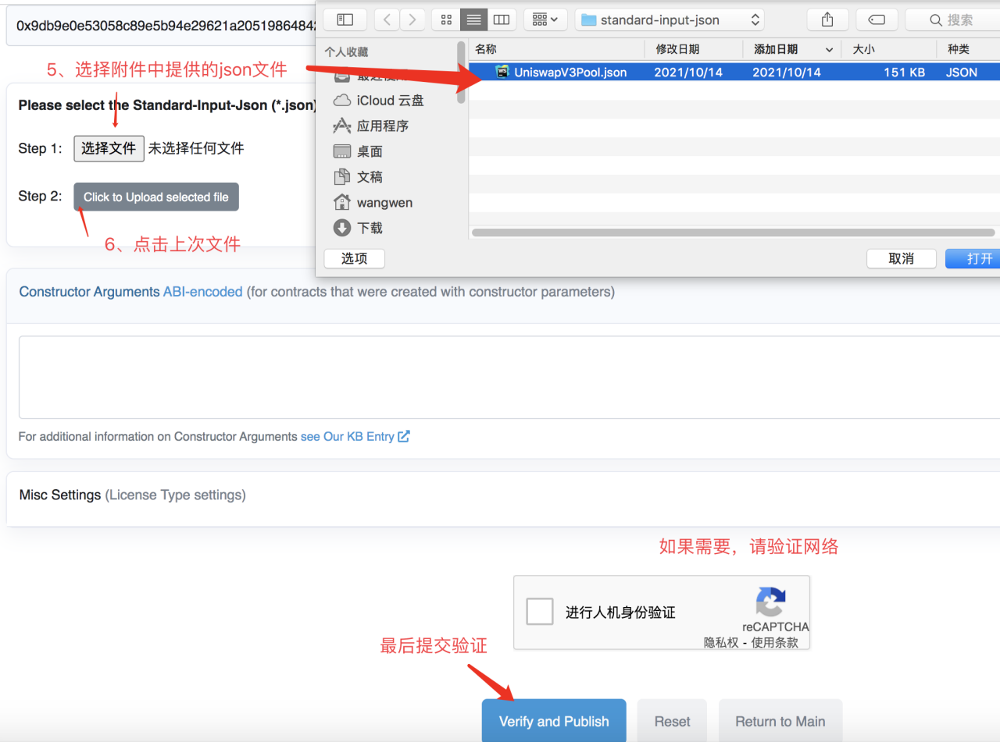
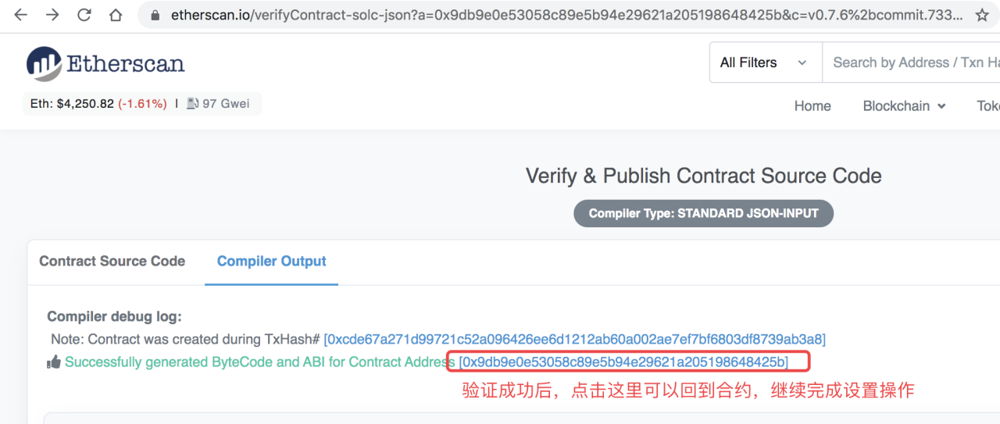

## 设置预言机长度参数

合约开源后，回到etherscan打开合约栏，连接钱包，执行如下操作：
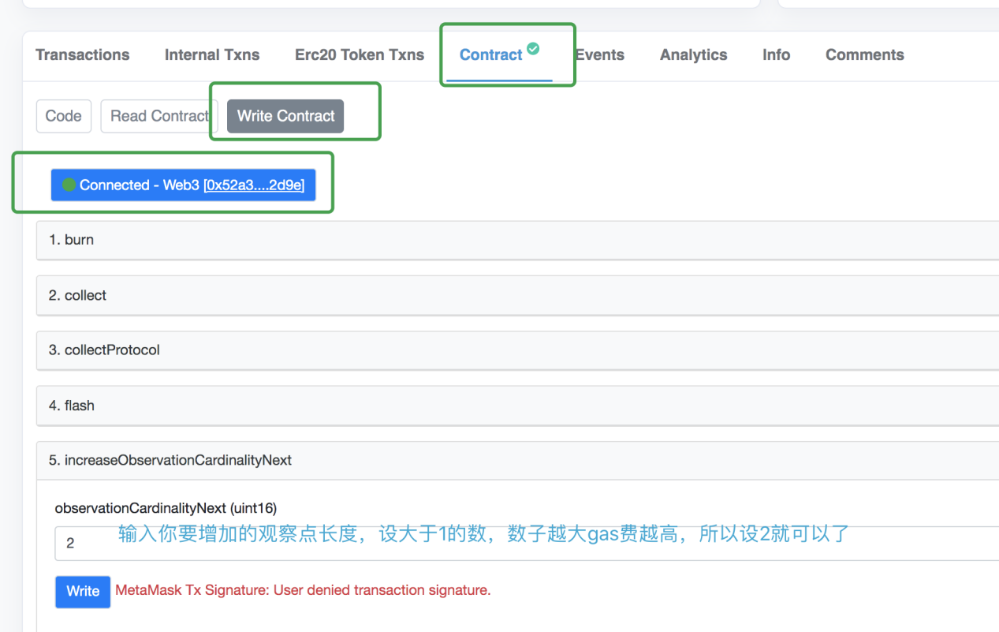

完成观察点设置后，还要等如下图所示的状态变成大于等于2的值后(只有该池子有人发起了新的swap后才会改变)才算成功：
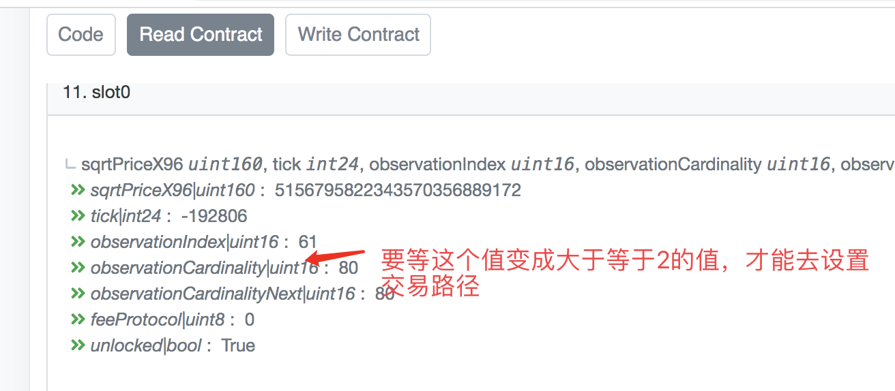

等上面的状态确认后，设置完成。

## 附件

<a href="../../assets/json/UniswapV3Pool.zip" target="_blank">验证合约需要的json文件，需要自行解压</a>