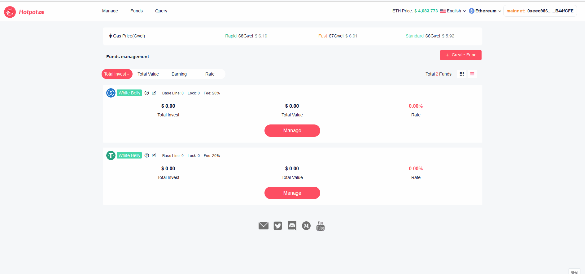

# 创建基金

> 如何在 [Hotpot](https://hotpot.fund) 上创建一支基金?     

## 创建基金

任何个人或机构，通过简单的几步操作，就可以在 Hotpot 平台上创建一支基金。

无论您是一位有经验的加密资产交易者或 Uniswap V3 流动性供应者，亦或是一个加密资产管理机构，都可以在 Hotpot 平台上免审核地创建一支以透明和免信任方式运作的基金。

基金经理需自行承担创建及管理基金的 Gas 费用。当为投资者创造出收益，投资者提取资金时，基金经理将获得投资者收益的分成。Hotpot 平台没有固定的基金管理费用，基金经理只有为投资者创造出收益，且当投资者提取资金时，才能获得收益分成。

基金经理根据自身的操作策略和投资者群体的特点，自行决定是否有锁仓期，以及基准收益率、基金经理分成比率等参数。

在浏览器或手机钱包中打开 [Hotpot Dapp](https://app.hotpot.fund)，点击 [基金管理](https://manager.hotpot.fund)，打开基金管理页面，连接您的钱包。点击 **创建基金** 按钮，填写您要设置的基金参数，包括：

* 基金名字

  > 限15个汉字，或30字节。

* 基金描述

  > 限100个汉字，或300字节。

* 基金本币

  > 投资者存取，基金核算都是使用基金本币。同时也是除了持有流动池资产之外，基金可以持有的唯一代币。

* 锁仓期(天)

  > 设置锁仓期为0，则表示这支基金是一支开放式基金，投资者可以随时存取。

* 基准收益率(%) ：

  > Hotpot 平台和基金经理一样，只有当投资者的收益率超过基准收益率之后，才会有收益分成。 

* 基金经理分成比率(%) 

  > 基金经理设置的只是基金经理的收益分成比率，Hotpot 平台 5%的收益分成比率是固定写死在智能合约中的。例如：设置基金经理分成比率为15%，则投资者实际承担的收益分成比率为：15% + Hotpot 平台的 5% = 20%，投资者在 UI 上看到的这支基金的分成比率就是 20%。

点击 **提交** 按钮，然后在钱包软件中确认提交，等待链上交易确认信息，就完成了基金创建过程。

## Gas 费用

在 Hotpot 平台上创建基金，本质上是通过 Hotpot 工厂，在以太坊上部署了一个新的基金智能合约。

部署一个基金智能合约的 Gas 消耗量大约是400万，以太坊上完成一笔交易所需的 Gas 费用的计算公式是：Gas 消耗量 * Gas 单价。我们以 Gas 单价 50 GWei 为例：    
$$
4 * 10^6 * 50 GWei = 0.2 ETH
$$

可以看出，当 Gas 单价为 50 GWei 时，创建一支基金所需的 Gas 费用大约是 0.2 ETH。

关于以太坊 Gas 费用计算的详情，请参考 [如何计算以太坊 Gas 费用]()

