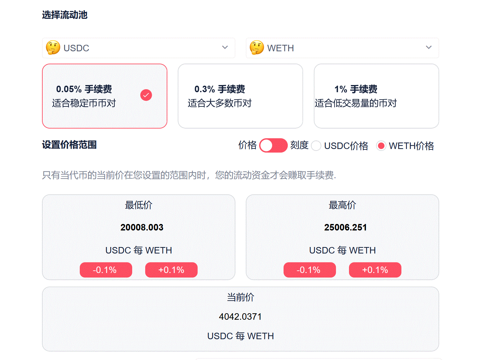

# 附录：如何持有单一币种?

基金经理可能希望持有某种代币，Hotpot 平台上的基金不仅可以持有基金本币，也可以持有其它代币，只是持有的方式还是通过投资流动池来实现的。

我们以投资 USDC/ETH 0.05% 交易对流动池为例：

* **持有ETH** 您可以新增如下图所示的头寸：

**图中所示** 当前 ETH/USDC 的兑换价格是 4042 USDC/ETH，而头寸设置的价格区间是 20,008 - 25006 USDC/ETH。由于头寸价格范围远高于当前价格，所以当您向该头寸增加投资时，添加进流动池的资产全部是 ETH。关于投资时两种代币的分布情况，请参阅 [**关于代币分布**](./13-附录4：关于代币分布.md)。此操作相当于在当前价格购入并投资了 ETH，在 ETH 价格没有达到价格范围下限之前，您所购入的 ETH 都不会被卖出。

> 虽然此时基金持有的全部是 ETH，但在 Dapp 和 Query 中显示的该项资产依然是 USDC/ETH 交易对的流动池资产。
>
> 由于当前价格没有落在该头寸的价格范围内，所以该头寸不能获得手续费收益，它的投资策略就是以当前价格购入并持有 ETH。
>
> 请准确理解**兑换价格**的意义。以上图为例：ETH 兑换 USDC 的当前价格是 4042 USDC/ETH，即每个 ETH 可兑换 4042 USDC；而 USDC 兑换 ETH 的当前价格则是 0.000247 ETH / USDC，即每个 USDC 可兑换 0.000247 ETH。 关于 Hotpot 平台价格表示方法的详细信息，请参阅 [**关于价格范围**](./11-附录2：关于价格范围.md)。

* **持有USDC** 同理，如果您设置的头寸价格范围远低于当前的 ETH 价格，当您向该头寸增加投资时，添加进流动池的资产全部是 USDC。此操作相当于持有 USDC。

## 如何选择流动池?

通过以上介绍，聪明的基金经理或许已经发现，实际上如果希望持有 ETH 的话，可以选择的流动池很多。只要该流动池有足够的流动性，例如：USDC/ETH 0.3%; WBTC/ETH 0.3%; USDC/ETH 0.05%。这些交易对都有足够的流动性，通过投资它们都可以完成持有 ETH 的操作。

那么，如何选择流动池，持有其它代币呢？我们的建议是尽量选择流动性充裕，TVL 值较大的流动池。

> 比如，您希望在当前价格购入并持有 UNI，可以选择 UNI/ETH 0.3% 的交易对。
>
> 假如您的基金本币是 USDC，UNI 的交易路径可以设置为 USDC/ETH 0.05% - ETH/UNI 0.3%；ETH 的交易路径设置为 USDC/ETH 0.05%。假如当前流动池中 UNI 的价格为 1 UNI = 0.0047 ETH，设置的头寸价格范围应远高于它，比如 [0.05-0.1] ETH 即可。当您向该头寸投资时，添加进流动池的资产全部是 UNI，相当于以当前价格购入并持有 UNI。
>
> 以上关于交易路径和头寸价格范围设置的建议，仅供参考！

通过上述方法，基金经理在 Hotpot 平台上可以持有 Uniswap V3 交易所上的所有代币。
