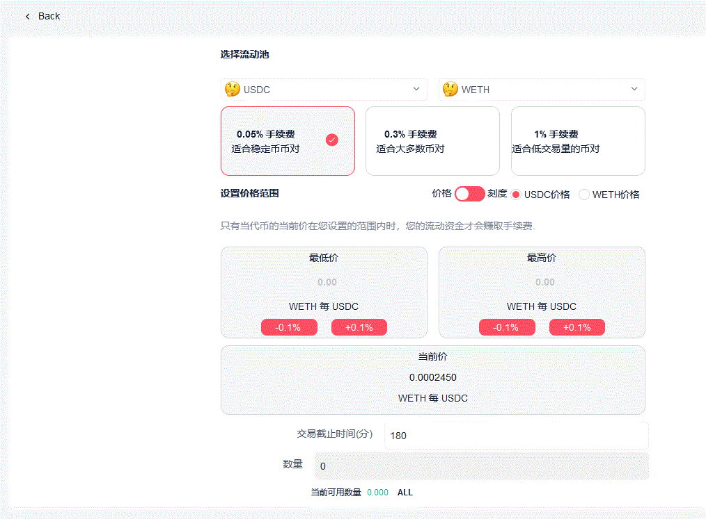
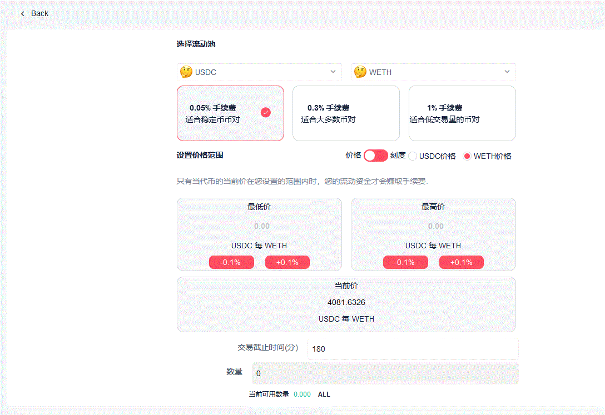
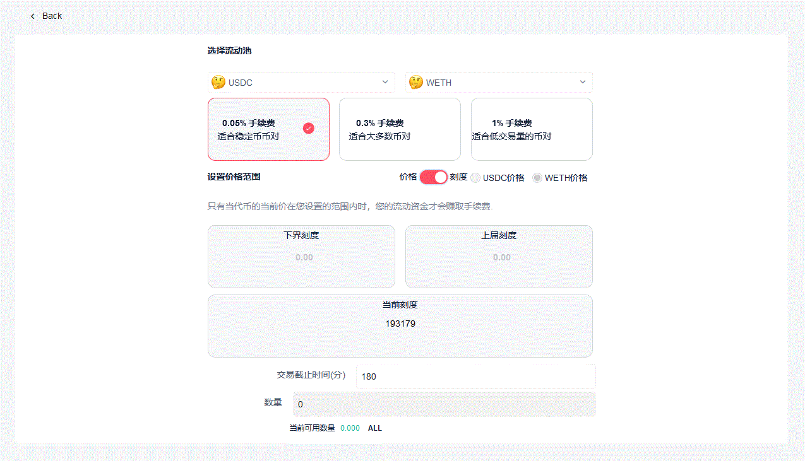

# 关于价格范围

## 价格范围(Price Range)

在Hotpot 基金管理页面上，同时提供了价格和刻度两种价格表示方式。以 $$token0$$​ 和 $$token1$$​ 表示交易对中的两种代币，Hotpot 可以直接显示和输入两种兑换价格( $$token1\ /\ token0$$ 和  $$token0\ /\ token1$$)。默认显示的是 $$token0$$ 价格。$$token0$$​​ 的价格显示为：

$$Price_0 = token1 \ / \ token0$$​​​

同理，$token1$ 的价格显示为：

$$Price_1=token0\ /\ token1$$​​​

在输入价格范围时，请准确理解当前在设置的是哪种代币。在输入价格范围时，Hotpot 内部会将您输入的价格转换为刻度，转换后可能会微调您所输入的价格。关于刻度的计算方法，请参阅 [**刻度**](#tick)。

>  我们以 USDC/ETH 0.05% 交易对为例，该交易对中 $$token0$$ 是 USDC，$$token1$$ 是 WETH。默认显示的是 $$token0$$​​，即 USDC的价格。如下图所示，当前价格显示为 0.0002450 WETH 每 USDC，此时输入的价格范围是 USDC 的价格范围：

> 切换成 WETH 价格，则当前价格显示为 4081.6326 USDC 每 WETH，此时输入的价格范围是 WETH 的价格范围：

## 刻度(tick)

Hotpot 基金全部都是通过 Uniswap V3 流动池来完成投资，在体现交易对中两种代币的价格时，也是沿用 Uniswap V3 的方式，用刻度(tick) 来表示兑换价格。

我们以 $$token0$$​​​ 和 $$token1$$​​​ 表示交易对中的两种代币，以 $$Price_0$$​​​ 来表示交易对中 $$token0$$​​​ 的价格，即 1单位的 $$token0$$ 可以兑换多少单位的 $$token1$$​​​ (关于代币精度和单位，请参阅 [**代币精度**](#decimals))。

刻度的定义是：    

$$tick = \log_{1.0001}{Price_0}$$​​

可以看出，刻度是一个以 1.0001​​​ 为底的对数值(可以为负数)，意味着每2个相邻刻度之间的价格差是 0.01% (万分之一)，0.01% 也是 Hotpot 平台可以设置的最小价格变化幅度。

> 用对数值表示价格有诸多好处：一是价格波动幅度的数学表示更加均匀；二是两种兑换价格的对数值等价，所以只需要存储一个变量；三是同样大小的数字可以表示出更大的价格范围。这跟基金经理的管理工作无关，有兴趣的话可以参阅 Uniswap V3 白皮书。

> 我们同样以 USDC/ETH 0.05% 交易对为例。切换到刻度方式，当前刻度显示为 193179，即：
>
> $$193179 = \log_{1.0001}{Price_0}$$​
>
> $$ Price_0 = 1.0001^{193179}$$​
>
> $$ Price_0 = 245040526.6$$​
>
> 即，1单位的 USDC 可以兑换 245,040,526.6 单位的 WETH。由于 USDC 的精度为6位，WETH 的精度为18位，即 1单位($$10^{-6}$$)​ USDC 可以兑换245,040,526.6 单位($$10^{-18}$$​) 的​ WETH。 用等式表示就是：
>
> $$ 10^{-6}\ USDC = 245040526.6 * 10^{-18}\ WETH$$
>
> 则 $$ 1\ USDC = 0.0002450405266\ WETH $$  

如果您要输入刻度来确定价格范围，则需要确定价格之后，将上面的计算过程反推一次。

## 代币精度(decimals)

以太坊 ERC20 代币都需要定义代币精度(decimals)，代币精度表示该代币的最小单位。

> 例如，WETH 的代币精度为18位，它的最小计量单位命名为 Wei，1 WETH 表示为 Wei 则是：$$10^{18}$$​​ Wei。
>
> 最小单位 1 Wei = $$10^{-18}$$​ WETH

ERC20 代币规范中规定了必须指定代币精度，最小计量单位的命名并不重要。

> 例如，USDC 的代币精度为6，1 USDC 表示为数字形式则是：$$10^{6}$$​​
>
> 最小单位 1 = $$10^{-6}$$​ USDC

